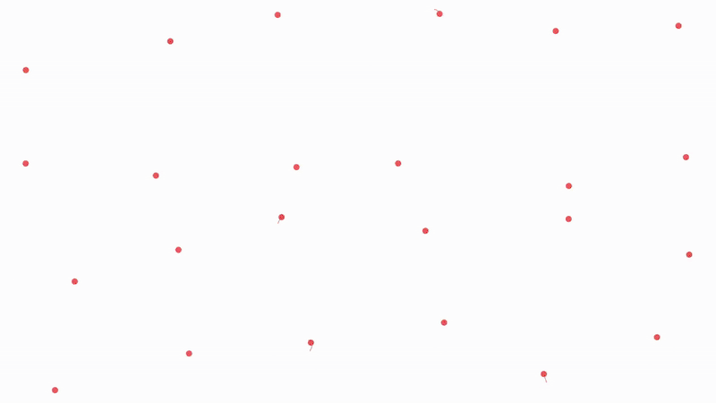
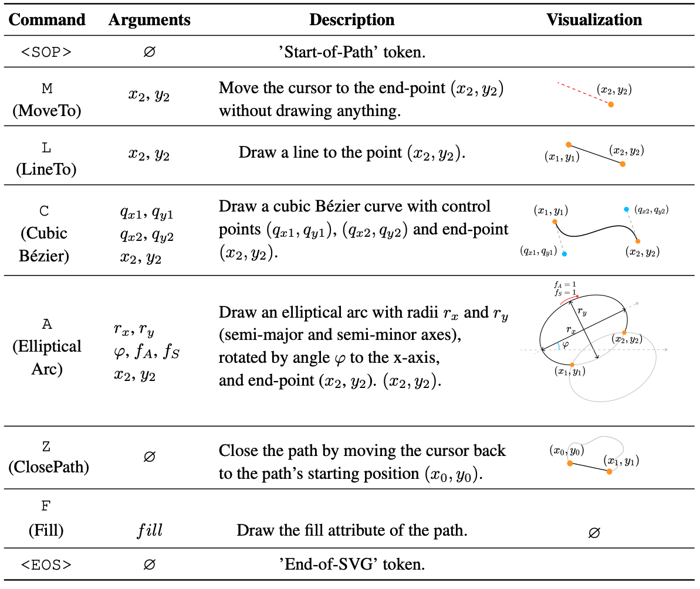

<!-- <div align= "center">
    <h1> Official repo for OmniSVG</h1>

</div> -->

<h3 align="center"><strong>OmniSVG: A Unified Scalable Vector Graphics Generation Model</strong></h3>


<div align="center">
<a href='https://arxiv.org/abs/2504.06263'></a> &nbsp;&nbsp;&nbsp;&nbsp;
 <a href='https://omnisvg.github.io/'></a> &nbsp;&nbsp;&nbsp;&nbsp;
<a href="https://huggingface.co/OmniSVG/OmniSVG"></a> &nbsp;&nbsp;&nbsp;&nbsp;
<a href="https://huggingface.co/OmniSVG"></a> &nbsp;&nbsp;&nbsp;&nbsp;
<a href="https://huggingface.co/spaces/OmniSVG/OmniSVG-3B"></a>
</div>

## 🔥🔥🔥 News !!

- [2025/07/22] 👋 We have released the Huggingface Demo. 🤗[Demo](https://huggingface.co/spaces/OmniSVG/OmniSVG-3B).
- [2025/07/22] 👋 We have released the inference code and model weight of MMSVG-Icon and MMSVG-Illustration dataset. 🤗[Weight](https://huggingface.co/OmniSVG/OmniSVG).
- [2025/04/09] 👋 Release MMSVG-Icon and MMSVG-Illustration 🤗[Dataset](https://huggingface.co/OmniSVG).
- [2025/04/09] 👋 Upload paper and init project. [Read](https://arxiv.org/abs/2504.06263)


<p align="center">
    
</p>

## 🧩 Community Contributions
If you are developing / using OmniSVG in your projects, or you want to contribute to OmniSVG, please let us know 🎉.

- If you find data issues when using MMSVG dataset, please drop an issue in this [form](https://npqawhh9ht.feishu.cn/wiki/KHv2wDqAxiSV8skpkANcbmlwnqc?from=from_copylink).

## 📑 Open-source Plan
- [x] Project Page & Technical Report
- [x] MMSVG-Icon and MMSVG-Illustration Dataset Release
- [x] Inference Code & Model Weight of MMSVG-Icon and MMSVG-Illustration Dataset
- [x] Online Demo (Gradio deployed on Huggingface)
- [ ] Model Weight of OmniSVG-7B Release
- [ ] MMSVG-Character Dataset Release
- [ ] Model Weight of MMSVG-Character Dataset Release


## 1. Introduction

**OmniSVG** is the first family of end-to-end multimodal SVG generators that leverage pre-trained Vision-Language Models (VLMs), capable of generating complex and detailed SVGs, from simple icons to intricate anime characters. We also introduce MMSVG-2M, a multimodal dataset with two million richly annotated SVG assets, along with a standardized evaluation protocol for conditional SVG generation tasks. 


## 2. Models Downloading
| Model                       | Download link                   | Size       | Update date |                                                                                     
|-----------------------------|-------------------------------|------------|------|
| OmniSVG-3B| 🤗 [Huggingface](https://huggingface.co/OmniSVG/OmniSVG)    | 8.49 GB | 2025-07-22  | 


##  3. Dependencies and Installation
The dependencies configured according to the following instructions provide an environment equipped for inference

### 3.1 Clone the Repository
```bash
git clone https://github.com/OmniSVG/OmniSVG.git
cd OmniSVG
```

### 3.2 Create Conda Environment
Create and activate a new conda environment with Python 3.10:
```bash
conda create -n omnisvg python=3.10
conda activate omnisvg
```

### 3.3 Install Dependencies

#### System Dependencies
Before installing Python packages, you need to install Cairo library which is required by `CairoSVG` in our dependencies:

**macOS:**
```bash
brew install cairo
```

**Linux (Ubuntu/Debian):**
```bash
sudo apt update
sudo apt install libcairo2 libcairo2-dev
```

> **Note:** Installing Cairo system library beforehand helps prevent potential build errors when installing `CairoSVG` via pip.

#### Python Dependencies
We have tested our environment with CUDA 12.1. You can install CUDA 12.1 by following the [CUDA Toolkit installation guide](https://developer.nvidia.com/cuda-12-1-0-download-archive).

Install PyTorch with CUDA 12.1 support:
```bash
pip install torch==2.3.0+cu121 torchvision==0.18.0+cu121 --index-url https://download.pytorch.org/whl/cu121
```

Install remaining dependencies:
```bash
pip install -r requirements.txt
```

## 4. Inference Script

|                                                  | GPU Memory Usage | Time per 256/512/1024/2048/4096 tokens |
| ------------------------------------------------ | ---------------- | ----------------- |
| OmniSVG-3B     | 17G              | 4.08/8.68/18.07/37.51/82.70 seconds       |

<font color="red">**Note: The inference time shown here is measured per OmniSVG SVG tokens, while the inference time reported in our paper is measured per XML code tokens for fair comparison with baseline methods.**</font> 

### Quick Start

**Download Model Weights**
First, install the Hugging Face CLI tool:
```bash
pip install huggingface-hub
```
  **Download the model from Hugging Face:**
   ```bash
   # Download to your directory
   huggingface-cli download OmniSVG/OmniSVG --local-dir /PATH/TO/OmniSVG-3B
   ```
 **Run Inference**
   
   Execute the following command to run inference:
   ```bash
   #image-to-svg
   python inference.py --input_dir ./examples --output_dir ./output --task_type image-to-svg --weight_path /PATH/TO/OmniSVG-3B
   ```

   ```
   #text-to-svg
   python inference.py --input_dir ./examples.txt --output_dir ./output --task_type text-to-svg --weight_path /PATH/TO/OmniSVG-3B
   ```

### Interactive Demo

We provide an interactive generation interface using Gradio:

- **Local Deployment**
  ```bash
  python app.py
  ```

- **Online Demo**
  
  Try our live demo on [Hugging Face Spaces](https://huggingface.co/spaces/OmniSVG/OmniSVG-3B)

<div align="center">
  
  
</div>

## 5. License
OmniSVG is licensed under the [**Apache License 2.0**](https://www.apache.org/licenses/LICENSE-2.0), while MMSVG dataset is under [**Creative Commons Attribution Non Commercial Share Alike 4.0 License**](https://spdx.org/licenses/CC-BY-NC-SA-4.0). You can find the license files in the respective github and HuggingFace repositories.


<!-- ##  🧩 Dataset - MMSVG-2M -->

## Citation

```bibtex
@article{yang2025omnisvg,
  title={OmniSVG: A Unified Scalable Vector Graphics Generation Model}, 
  author={Yiying Yang and Wei Cheng and Sijin Chen and Xianfang Zeng and Jiaxu Zhang and Liao Wang and Gang Yu and Xinjun Ma and Yu-Gang Jiang},
  journal={arXiv preprint arxiv:2504.06263},
  year={2025}
}
```

## Acknowledgments
We thank the following excellent open-source works:

[IconShop](https://icon-shop.github.io/): is the first advanced work that leverages LLMs to generate monochrome, icon-level SVGs. We referred to its parametric implementation.

Here is the list of highly related concurrent works:

[LLM4SVG](https://arxiv.org/abs/2412.11102): treats SVG coordinates as number strings and predicts decimal part for higher spatial accuracy.

[StarVector](https://starvector.github.io/): equips LLM with an image encoder for Image-to-SVG generation.

## Star History


[](https://www.star-history.com/#OmniSVG/OmniSVG&Date)

